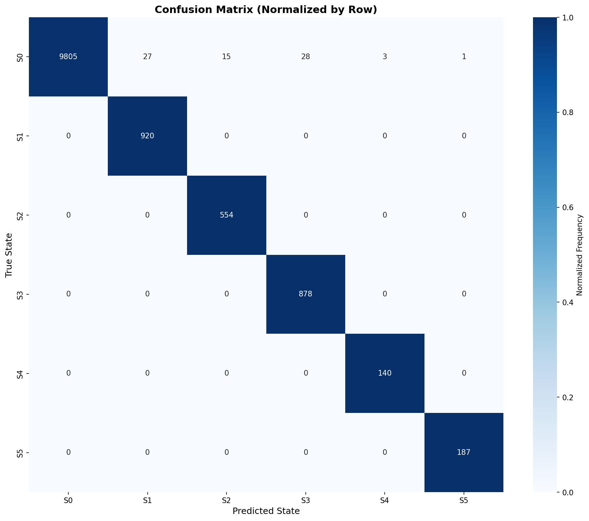

# Causal Analysis of Conversational Defects

## Hybrid Neuro-Symbolic Architecture for Root Cause Analysis in Customer Service

**NEW: 🤖 LLM-Powered Interactive Reasoning with Google Gemini**

---

## 📋 Table of Contents

1. [Overview](#overview)
2. [Architecture](#architecture)
3. [Installation](#installation)
4. [Quick Start](#quick-start)
5. [Detailed Usage](#detailed-usage)
6. [Interactive LLM Reasoning](#interactive-llm-reasoning-new)
7. [Project Structure](#project-structure)
8. [Configuration](#configuration)
9. [Results & Evaluation](#results--evaluation)
10. [Troubleshooting](#troubleshooting)

---

## 🎯 Overview

This project implements a **Hybrid Neuro-Symbolic Architecture** that goes beyond traditional sentiment analysis to identify the **root cause** of conversation breakdowns in customer service interactions.

### The Problem

Traditional sentiment analysis tells us *that* a customer is angry, but not:
- **Why** they became angry
- **When** the conversation broke down
- **What specific turn** caused the escalation

### The Solution

A three-stage pipeline combining:

1. **Deep Learning** (BERT + GRU) for state recognition
2. **Probabilistic Modeling** (Markov Chains) for baseline conversation dynamics
3. **Causal Reasoning** (Delta Risk Analysis) for root cause identification

---

## 🏗️ Architecture

### State Space

Conversations are mapped to a discrete state space:

| State | Name | Description |
|-------|------|-------------|
| S₀ | Greeting/Neutral | Politeness, standard opening/closing |
| S₁ | Info Exchange | Neutral data gathering |
| S₂ | Problem Statement | Customer describing the issue |
| S₃ | Solution Offer | Agent proposing a fix |
| S₄ | Friction/Pushback | Dissatisfaction (pre-escalation warning) |
| S₅ | Escalation/Anger | Complete breakdown, demands for management |

### Neural Architecture

```
Text → BERT Embedding (384D) → GRU (Bidirectional, 2 layers) → Softmax → States
```

**Key Features:**
- Sentence-Transformers BERT (`all-MiniLM-L6-v2`)
- Bidirectional GRU for temporal context
- Focal Loss for class imbalance
- Mixed precision training (RTX 4060 optimized)

### Markov Chain

Transition matrix **M** represents "Normal Physics" of conversations:

```
M[i][j] = P(S_{t+1} = j | S_t = i)
```

### Root Cause Algorithm

For each turn **t**, calculate risk jump:

```
ΔRisk_t = Risk_{t+1} - Risk_t
```

Where:
```
Risk_t = α · M[s_t][5] + (1-α) · GRU_softmax[t][5]
```

The turn with maximum **ΔRisk** is identified as the **root cause**.

---

## 🚀 Installation

### Requirements

- Python 3.8+
- CUDA 12.1+ (for GPU acceleration)
- 8GB+ GPU VRAM (tested on RTX 4060)

### Step 1: Clone Repository

```bash
git clone <repository-url>
cd conversational-defects-analysis
```

### Step 2: Install Dependencies

```bash
pip install -r requirements.txt
```

### Step 3: Verify Installation

```bash
python -c "import torch; print(f'CUDA Available: {torch.cuda.is_available()}')"
```

---

## ⚡ Quick Start

### Option 1: Run Complete Pipeline (with demo data)

```bash
python main.py
```

This will:
1. Create a demo dataset (if your data file is missing)
2. Perform silver labeling
3. Embed conversations with BERT
4. Train the neural model
5. Build Markov chain
6. Evaluate on test set
7. Run root cause analysis on sample conversations

### Option 2: Train on Your Data

Place your dataset at `Conversational_Transcript_Dataset.json` and run:

```bash
python main.py --mode train
```

**Dataset Format:**

```json
[
  {
    "transcript_id": "12345",
    "conversation": [
      {"speaker": "Customer", "text": "My internet is down"},
      {"speaker": "Agent", "text": "I can help with that"}
    ]
  }
]
```

### Option 3: Inference Only

Analyze new conversations with a trained model:

```bash
python main.py --mode inference \
  --model models/best_model.pth \
  --markov models/markov_chain.npz \
  --data new_conversations.json
```

### Option 4: Interactive LLM Session (NEW) 🤖

Ask questions about why conversations escalated:

```bash
# Set up Gemini API (one-time)
export GEMINI_API_KEY="your-api-key-here"
pip install google-generativeai

# Start interactive session
python interactive_session.py
```

**What you can ask:**
- "Why did the customer escalate?"
- "What should the agent have done differently?"
- "What patterns led to this escalation?"
- "How could this have been prevented?"

See [Interactive LLM Reasoning](#interactive-llm-reasoning-new) for full documentation.

---

## 📖 Detailed Usage

### Training Configuration

Edit `config.py` to customize:

```python
# Model architecture
GRU_HIDDEN_DIM = 256
GRU_NUM_LAYERS = 2
GRU_BIDIRECTIONAL = True

# Training
BATCH_SIZE = 32
LEARNING_RATE = 0.001
NUM_EPOCHS = 50

# Loss function
USE_FOCAL_LOSS = True
FOCAL_LOSS_GAMMA = 2.0
```

### Using Individual Modules

#### Silver Labeling

```python
from silver_labeling import create_silver_labels

all_states, confidences = create_silver_labels(conversations)
```

#### Embedding

```python
from embeddings import ConversationEmbedder

embedder = ConversationEmbedder()
embeddings = embedder.embed_all_conversations(conversations)
```

#### Training

```python
from train import Trainer

trainer = Trainer(model, train_loader, val_loader, class_weights)
trainer.train(num_epochs=50)
```

#### Root Cause Analysis

```python
from inference import create_analyzer_pipeline

pipeline = create_analyzer_pipeline(
    model_path="models/best_model.pth",
    markov_path="models/markov_chain.npz"
)

result = pipeline.analyze_conversation(conversation)
pipeline.print_detailed_analysis(result)
```

---

## 🤖 Interactive LLM Reasoning (NEW)

### Overview

The system now includes **LLM-powered interactive reasoning** that combines your mathematical root cause analysis with natural language AI to answer questions about why conversations escalated.

**Key Features:**
- 🧠 Natural language Q&A about escalations
- 📊 Context-aware responses based on mathematical analysis
- 💾 Session history tracking
- 📄 Executive summary generation
- 🔄 Auto-discovery of available Gemini models

### Setup: Get a Gemini API Key

1. **Get Free API Key** (2 minutes):
   - Go to [Google AI Studio](https://aistudio.google.com/app/apikey)
   - Click "Get API Key" → "Create API Key"
   - Copy the key

2. **Install Gemini Library**:
   ```bash
   pip install google-generativeai
   ```

3. **Set Your API Key** (Choose one method):

   **Option A: Environment Variable (Recommended)**
   ```bash
   # Linux/Mac
   export GEMINI_API_KEY="your-api-key-here"
   
   # Windows CMD
   set GEMINI_API_KEY=your-api-key-here
   
   # Windows PowerShell
   $env:GEMINI_API_KEY="your-api-key-here"
   ```

   **Option B: Enter Interactively**
   ```bash
   # The script will prompt you if key not found
   python interactive_session.py
   ```

### Usage: Interactive Session

**Start an Interactive Analysis Session:**

```bash
python interactive_session.py
```

**What Happens:**

1. ✅ Loads your trained model and Markov chain
2. 🔍 Analyzes a test conversation
3. 🤖 Auto-discovers available Gemini models
4. 💬 Opens interactive Q&A session

**Example Session:**

```
TASK 2: INTERACTIVE REASONING SESSION
==================================================
🔍 Loading model from: models/best_model.pth
✅ Model loaded successfully.
⏳ Loading BERT Embedder...
🔎 Scanning for available Gemini models...
✅ Connected to Gemini Model: models/gemini-1.5-flash

⚙️  Analyzing Conversation...
✅ Call Analyzed. Root Cause Identified.

💬 Session Started. Type 'exit' to quit or 'report' to save.

Analyst: Why did the customer escalate?
AI: The customer escalated at Turn 4 because the agent said "I can't 
fix it right now. You have to wait." This created a risk spike of 0.87, 
moving from Friction (S4) to Escalation (S5). The customer had already 
expressed frustration about recurring issues ("This happens every week"), 
so the dismissive response was the breaking point.

Analyst: What should the agent have done differently?
AI: The agent should have:
1. Acknowledged the recurring nature of the problem
2. Offered immediate troubleshooting steps instead of dismissing the issue
3. Provided a concrete timeline rather than "you have to wait"
4. Escalated to a supervisor proactively given the customer's frustration

Analyst: report
📄 Report saved to Session_Report.txt

Analyst: exit
```

### Using the LLM Interface Programmatically

**For Custom Integrations:**

```python
from llminterface import LLMReasoningEngine
from inference import create_analyzer_pipeline

# Step 1: Analyze conversation
pipeline = create_analyzer_pipeline(
    model_path="models/best_model.pth",
    markov_path="models/markov_chain.npz"
)

conversation = [
    {"speaker": "Customer", "text": "My internet is down again."},
    {"speaker": "Agent", "text": "I can help with that. Let me check."},
    {"speaker": "Customer", "text": "This happens every week."},
    {"speaker": "Agent", "text": "I can't fix it right now. You have to wait."},
    {"speaker": "Customer", "text": "This is ridiculous! I want a manager!"}
]

analysis = pipeline.analyze_conversation(conversation)

# Step 2: Initialize LLM Engine
llm = LLMReasoningEngine(api_key="your-gemini-key")

# Step 3: Ask Questions
chat_history = []

question = "Why did the customer escalate?"
answer = llm.ask(question, analysis, chat_history)
print(f"AI: {answer}")

chat_history.append((question, answer))

# Step 4: Generate Executive Summary
summary = llm.generate_executive_summary(analysis, chat_history)
print(f"\nExecutive Summary:\n{summary}")
```

### Features Breakdown

#### 1. **Auto-Discovery of Gemini Models**

The system automatically finds the best available model:

```python
🔎 Scanning for available Gemini models...
✅ Connected to Gemini Model: models/gemini-1.5-flash
```

**Priority Order:**
1. Models with "flash" (fastest, best for real-time)
2. Models with "pro" (more capable)
3. First available model supporting content generation

#### 2. **Mock Mode (No API Key Required)**

If you don't have a Gemini key, the system still works:

```
⚠️ GEMINI_API_KEY not found in environment.
   (Enter it below to enable AI mode)
🔑 Please paste your Gemini API Key here: [Press Enter to skip]

[MOCK MODE] Root cause found at Turn 4. 
(Set GEMINI_API_KEY to see real AI response)
```

#### 3. **Context-Aware Responses**

The LLM receives:
- Full conversation transcript with state labels
- Mathematical analysis (risk spikes, deltas)
- Root cause turn identification
- Previous Q&A history (last 3 turns)

**Example Context Sent to Gemini:**

```
TRANSCRIPT:
Turn 0 (Customer): "My internet is down again." (S2 - Problem_Statement)
Turn 1 (Agent): "I can help with that. Let me check." (S3 - Solution_Offer)
Turn 2 (Customer): "This happens every week." (S4 - Friction/Pushback)
Turn 3 (Agent): "I can't fix it right now. You have to wait." (S3 - Solution_Offer)
Turn 4 (Customer): "This is ridiculous! I want a manager!" (S5 - Escalation/Anger) [TRIGGER]

MATHEMATICAL ANALYSIS:
- Did Escalation Occur?: True
- Root Cause Identified At: Turn 4
- Risk Spike Confidence: 0.87
```

#### 4. **Session Commands**

| Command | Action |
|---------|--------|
| `exit` | End session and quit |
| `report` | Save analysis to `Session_Report.txt` |
| Any question | Get AI-powered answer |

### Advanced: Custom Prompts

Modify the prompt in `llminterface.py`:

```python
full_prompt = f"""
SYSTEM: You are an expert Root Cause Analysis AI for Customer Service.
You have access to a deep-learning analysis of a specific call.

DATA SOURCE:
{context_str}

INSTRUCTIONS:
1. Answer based strictly on TRANSCRIPT and MATHEMATICAL ANALYSIS
2. If asked "Why did they get angry?", cite the Trigger Phrase and Risk Spike
3. Be concise and professional
4. [ADD YOUR CUSTOM INSTRUCTIONS HERE]

User: {user_query}
AI:
"""
```

### Use Cases

**1. Quality Assurance**
```
Analyst: What patterns do you see in this escalation?
AI: This follows a "unresolved repeat issue" pattern. The customer 
mentioned recurring problems ("every week"), and the agent's dismissive 
response failed to acknowledge this history...
```

**2. Agent Training**
```
Analyst: What training gap does this reveal?
AI: The agent lacked empathy skills and de-escalation training. When 
faced with a frustrated repeat caller, they should have...
```

**3. Executive Reporting**
```python
summary = llm.generate_executive_summary(analysis, chat_history)
# Generates formal business report automatically
```

### Files Added

- **`interactive_session.py`** - Standalone interactive CLI
- **`llminterface.py`** - Reusable LLM reasoning engine class

### API Costs

**Google Gemini Pricing** (as of 2024):
- **Gemini 1.5 Flash**: FREE up to 1,500 requests/day
- **Gemini 1.5 Pro**: FREE up to 50 requests/day
- Prompts are ~500-1000 tokens each

**Cost Estimate:** Essentially FREE for most use cases

---

## 📁 Project Structure

```
.
├── config.py                 # Configuration & hyperparameters
├── data_loader.py           # Dataset loading & batching
├── silver_labeling.py       # Keyword-based state assignment
├── embeddings.py            # BERT embedding pipeline
├── model.py                 # BERT+GRU architecture & Focal Loss
├── markov_chain.py          # Transition matrix & causal analysis
├── train.py                 # Training loop with optimizations
├── evaluate.py              # Metrics & visualizations
├── inference.py             # Root cause analysis pipeline
├── main.py                  # Complete pipeline orchestrator
├── utils.py                 # Helper functions
├── quick_test.py            # Testing suite & interactive demo
├── interactive_session.py   # 🆕 LLM-powered Q&A interface (CLI)
├── llminterface.py          # 🆕 LLM reasoning engine (library)
├── requirements.txt         # Python dependencies
└── README.md               # This file

Generated Directories:
├── models/                  # Saved models & checkpoints
│   ├── best_model.pth      # Trained BERT+GRU model
│   ├── markov_chain.npz    # Transition matrix
│   └── embeddings.npy      # Cached BERT embeddings
├── results/                # Visualizations & metrics
│   ├── confusion_matrix.png
│   ├── training_history.png
│   └── conversation_*_analysis.png
└── logs/                   # Training logs
```

---

## ⚙️ Configuration

### Hardware Optimization

**For RTX 4060 (8GB VRAM):**
```python
BATCH_SIZE = 32
GRADIENT_ACCUMULATION_STEPS = 4
USE_MIXED_PRECISION = True
```

**For GPUs with more VRAM:**
```python
BATCH_SIZE = 64
GRADIENT_ACCUMULATION_STEPS = 2
```

**For CPU-only:**
```python
DEVICE = torch.device("cpu")
USE_MIXED_PRECISION = False
BATCH_SIZE = 16
```

### Windows-Specific Settings

```python
NUM_WORKERS = 0  # Must be 0 to avoid multiprocessing errors
```

### Class Imbalance Handling

```python
# Option 1: Focal Loss (recommended)
USE_FOCAL_LOSS = True
FOCAL_LOSS_GAMMA = 2.0

# Option 2: Weighted Cross Entropy
USE_FOCAL_LOSS = False
USE_CLASS_WEIGHTS = True
```

---

## 📊 Results & Evaluation

### Metrics

The system provides:

1. **Overall Accuracy**
2. **Per-Class Precision/Recall/F1**
3. **Confusion Matrix**
4. **Training History Plots**

### Visualization Outputs

**Confusion Matrix:**


**Training History:**
- Loss curves (train/val)
- Accuracy curves
- Learning rate schedule
- Overfitting indicator

**Per-Class Performance:**
- Precision by state
- Recall by state
- F1-score by state

**Root Cause Analysis:**
- State sequence timeline
- Risk trajectory
- Risk delta (jump) visualization

### Interpreting Results

**Good Model:**
- S₄ (Friction) recall > 40%
- S₅ (Escalation) recall > 50%
- No "Neutral Trap" (S₀ recall ≈ others)

**Neutral Trap Warning:**
```
⚠️  WARNING: Possible 'Neutral Trap' detected!
   Model may be over-predicting neutral states.
   S0 recall: 98.5%
   S4 recall: 12.3%
   S5 recall: 8.7%
```

**Solution:** Increase focal loss gamma or use heavier class weighting.

---

## 🔧 Troubleshooting

### Issue: CUDA Out of Memory

**Solution:**
```python
# In config.py
BATCH_SIZE = 16  # Reduce batch size
GRADIENT_ACCUMULATION_STEPS = 8  # Increase accumulation
```

### Issue: DataLoader Freezes (Windows)

**Solution:**
```python
NUM_WORKERS = 0  # Must be 0 on Windows
```

### Issue: Poor Minority Class Performance

**Symptoms:** S₄ and S₅ have very low recall

**Solutions:**
1. Increase focal loss gamma:
   ```python
   FOCAL_LOSS_GAMMA = 3.0
   ```

2. Add data augmentation for minority classes

3. Refine silver labeling keywords for S₄ and S₅

### Issue: Training Too Slow

**Solutions:**

1. Enable mixed precision:
   ```python
   USE_MIXED_PRECISION = True
   ```

2. Cache embeddings:
   ```python
   # Embeddings are automatically cached after first run
   # Delete models/embeddings.npy to regenerate
   ```

3. Reduce sequence length (if applicable)

### Issue: Model Overfitting

**Symptoms:** Validation loss increases while training loss decreases

**Solutions:**

1. Increase dropout:
   ```python
   GRU_DROPOUT = 0.5
   ```

2. Add weight decay:
   ```python
   WEIGHT_DECAY = 1e-4
   ```

3. Use early stopping (already enabled by default)

### Issue: LLM Features Not Working

**Symptoms:** Interactive session shows "Mock Mode" or API errors

**Solutions:**

1. **Install Gemini Library:**
   ```bash
   pip install google-generativeai
   ```

2. **Get API Key:**
   - Visit [Google AI Studio](https://aistudio.google.com/app/apikey)
   - Create free API key
   - Set environment variable:
     ```bash
     export GEMINI_API_KEY="your-key-here"
     ```

3. **Check API Quota:**
   - Free tier: 1,500 requests/day (Flash) or 50/day (Pro)
   - Check usage at [Google AI Studio Console](https://aistudio.google.com/)

4. **Model Not Found Error:**
   ```
   Error: Model 'gemini-pro' not found
   ```
   
   **Solution:** The auto-discovery will find available models. If you get this error, check:
   ```python
   import google.generativeai as genai
   genai.configure(api_key="your-key")
   for m in genai.list_models():
       print(m.name)
   ```

5. **API Rate Limit:**
   ```
   Error: Resource exhausted (429)
   ```
   
   **Solution:** You've hit the free tier limit. Wait 24 hours or upgrade to paid tier.

### Issue: Interactive Session Crashes

**Symptoms:** Script exits unexpectedly during Q&A

**Solutions:**

1. **Use Ctrl+D instead of Ctrl+C** to exit gracefully

2. **Check Model Files:**
   ```bash
   ls -lh models/best_model.pth
   ls -lh models/markov_chain.npz
   ```
   Both should exist and be >1MB

3. **Test Model Loading:**
   ```python
   python quick_test.py --test model
   ```

---

---

## 📝 License

MIT License - See LICENSE file for details


---

**Happy Analyzing! 🚀**

**The Model parameters and embed vectorization have not been uploaded onto the repository due to size constraints**
